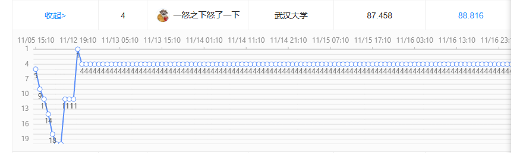

# Datacon2025 | NOVA-F

NOVA-F（No-cost On-site Vulnerability Analyzer - Fast）面向 DataCon 2025「漏洞攻击流量识别」任务，根据 HTTP 请求流量预测对应 CVE 标签。

## Final Rank




## 当前方案

项目采用本地离线检索式流水线：

1. 清洗 HTTP payload，去除弱区分度请求头并标准化空白。
2. 使用 SentenceTransformer 将 payload 编码为向量。
3. 使用 FAISS `IndexFlatIP` 做 top-k 相似检索。
4. 聚合近邻中的 CVE 候选，按最佳相似度和近邻投票排序。
5. 使用阈值、多标签策略和空标签近邻负证据抑制输出最终结果。
6. 可选加载训练集 K-fold 学到的低精度高误报 CVE blocklist，做最终输出级过滤。

当前默认模型仍是：

```text
models/all-MiniLM-L6-v2
```

已试验 `BAAI/bge-small-en-v1.5` 和 `intfloat/e5-small-v2`。BGE small 在小 holdout 上只有轻微收益但 CPU 成本明显更高，E5 small 效果低于 MiniLM，因此暂不替换默认模型。

## 安装环境

Linux/WSL：

```bash
./setup_install.sh
source ./.venv/bin/activate
```

Windows PowerShell 可使用已有 `.venv`：

```powershell
.\.venv\Scripts\activate
```

核心依赖：

```text
numpy
pandas
tqdm
faiss-cpu
sentence-transformers
```

如果 WSL 访问 HuggingFace 不稳定，建议提前在 Windows 侧下载模型，再复制到：

```text
models/all-MiniLM-L6-v2
```

运行时显式指定：

```bash
--model-path ./models/all-MiniLM-L6-v2
```

## 数据准备

官方授权数据不纳入 Git。放置路径约定为：

```text
data/datacon2025/datacon2025-xlab-httpcve/data-release/train.json.gz
data/datacon2025/datacon2025-xlab-httpcve/data-release/test.json.gz
```

转换为项目 CSV：

```bash
python utils/convert_datacon_jsonl.py \
  --input ./data/datacon2025/datacon2025-xlab-httpcve/data-release/train.json.gz \
  --output ./data/train_payload.csv

python utils/convert_datacon_jsonl.py \
  --input ./data/datacon2025/datacon2025-xlab-httpcve/data-release/test.json.gz \
  --output ./data/test_payload.csv
```

CSV 字段要求：

```text
id
payload_decoded
labeled
cve_labels
```

## 推荐运行

先合并扩展训练集和官方训练集，构建 combined 训练集：

```bash
python utils/merge_training_csv.py \
  --input ./data/train_with_ultimate.csv \
  --input ./data/train_payload.csv \
  --output ./data/experiments/train_combined.csv
```

再运行主流水线：

```bash
python main.py \
  --train-path ./data/experiments/train_combined.csv \
  --test-path ./data/test_payload.csv \
  --test-payload-column payload_decoded \
  --store-dir ./embeddings/faiss_store_combined \
  --output-path ./data/experiments/test_official_optimized.csv \
  --model-path ./models/all-MiniLM-L6-v2 \
  --reuse-cache
```

当前默认关键参数：

```text
--top-k 50
--max-candidates 5
--base-threshold 0.86
--min-votes 1
--vote-weight 0.015
--empty-penalty-margin 0.05
--empty-penalty-floor 0.80
--empty-penalty-ratio 0.50
```

关闭空标签近邻抑制用于对照实验：

```bash
--empty-penalty-margin -1
```

可选启用训练集 K-fold 学到的最终输出 blocklist：

```bash
--prediction-blocklist ./data/experiments/fold_blocklist_fp20_p002_mf2.txt
```

注意：blocklist 必须说明来源。当前推荐候选来自训练集 out-of-fold 统计，不来自官方测试集真值；该参数默认关闭。

## 评估

对带真值的 CSV 评估：

```bash
python utils/evaluate_predictions.py \
  --truth ./data/test_payload.csv \
  --pred ./data/experiments/test_official_optimized.csv
```

基于缓存 top-k 检索结果做参数搜索：

```bash
python utils/tune_retrieval_params.py \
  --truth ./data/test_payload.csv \
  --search ./data/experiments/search_top50_combined.npz \
  --meta ./embeddings/faiss_store_combined/meta.json \
  --bases 0.84,0.86,0.88,0.90 \
  --empty-margins=-1,0.02,0.05,0.08
```

## 当前最佳本地结果

官方测试集本地评估，使用 combined 索引 + 空标签近邻抑制：

```text
all_rows
exact_match: 0.928129
precision:   0.666632
recall:      0.710354
micro_f1:    0.687799
macro_f1:    0.523245

labeled=1
exact_match: 0.876334
precision:   0.828398
recall:      0.710354
micro_f1:    0.764848
macro_f1:    0.592976
```

相对早期扩展训练集 baseline：

```text
all_rows micro_f1: 0.259270 -> 0.687799
labeled=1 micro_f1: 0.561300 -> 0.764848
all_rows precision: 0.156417 -> 0.666632
```

训练集 K-fold blocklist 后处理研究结果：

```text
precision: 0.758393
recall:    0.709120
micro_f1:  0.732930
macro_f1:  0.535373
```

该 blocklist 来自训练集 out-of-fold 预测统计，配置为 `min_fp=20,max_precision=0.02,min_folds=2`，共 92 个 CVE；默认不启用。

## 主要文件

```text
main.py                              # 一站式清洗、建库、检索、预测
src/preprocess.py                    # payload 清洗和 CVE 标签归一化
src/build_faiss.py                   # FAISS 索引构建
src/search_faiss.py                  # FAISS 检索、候选聚合、负证据抑制
utils/convert_datacon_jsonl.py       # 官方 json.gz 转 CSV
utils/merge_training_csv.py          # 合并训练集
utils/evaluate_predictions.py        # 本地评估
utils/tune_retrieval_params.py       # 基于 top-k 缓存调参
utils/learn_blocklist_from_folds.py  # 训练集 OOF 学习高误报 CVE blocklist
PROGRESS_REPORT.md                   # 当前进度记录
TECHNICAL_OPTIMIZATION_REPORT.md     # 技术优化复盘
OPTIMIZATION_WORKFLOW_PLAN.md        # 后续实验流程和上下文接续记录
```

## 数据与 Git 管理

以下内容默认不上传：

```text
data/datacon2025/
data/train_payload.csv
data/test_payload.csv
data/experiments/
models/
embeddings/
ans/
wp.pdf
wp_extracted.txt
```

授权数据、模型权重、向量索引和预测输出只保留在本地。
